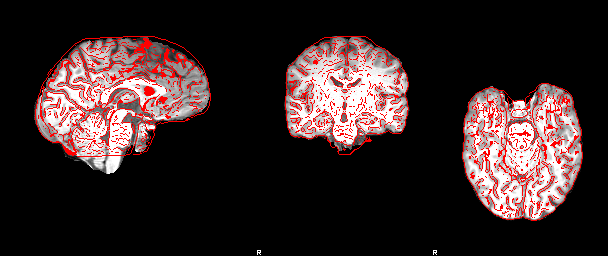

# 2 stage warp using ants

see [`./gre-mni_registration.bash`](gre-mni_registration.bash)

* fsl's `bet` to skullstrip. could use spm, `3dSkullstrip`, or [`ROBEX`](https://www.nitrc.org/projects/robex)
* ants for both `t1<->MNI`  and `gre<->t1`. normal processing stream uses fsl's `fnirt`
* using fsl's MNI152 template -- *brain only*. should use https://www.templateflow.org/browse/ template (a la fmriprep)

## Images
output of `slicer`

### GRE -> T1

### T1 -> MNI

### GRE -> T1 -> MNI

